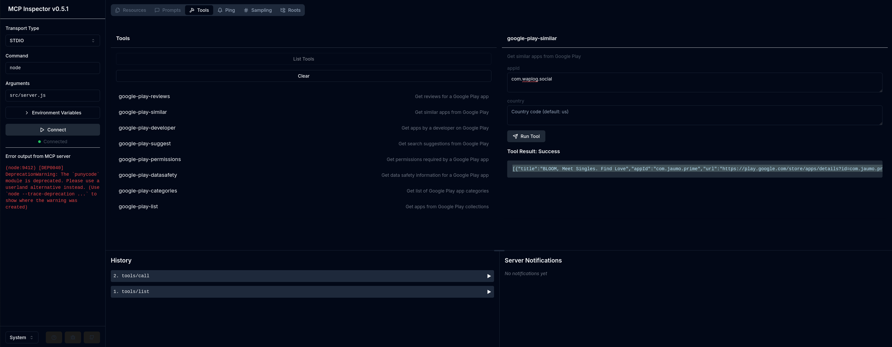

# App Market Intelligence MCP (with Revenue Analytics)

> **Note:** This project is a fork of [JiantaoFu/AppInsightMCP](https://github.com/JiantaoFu/AppInsightMCP). The original MCP provides comprehensive app market intelligence. This fork extends it by adding revenue analytics tools (Sensor Tower integration) for App Store and Google Play apps.

An MCP server that provides comprehensive market intelligence and **revenue analytics** by analyzing data from both the Apple App Store and Google Play Store. Get insights about apps, market trends, competitors, user feedback, and now—**app revenue and monetization metrics**—across the major mobile app marketplaces.

## API Coverage

### App Store API Coverage

| API Function | Implemented | MCP Tool Name | Description |
|-------------|-------------|---------------|-------------|
| app         | ✅ | app-store-details | Get detailed information about an App Store app |
| list        | ✅ | app-store-list | Retrieve apps from iTunes collections |
| search      | ✅ | app-store-search | Search for apps on the App Store |
| developer   | ✅ | app-store-developer | Get apps by a developer |
| privacy     | ✅ | app-store-privacy | Get privacy details for an app |
| suggest     | ✅ | app-store-suggest | Get search suggestions |
| similar     | ✅ | app-store-similar | Get similar apps |
| reviews     | ✅ | app-store-reviews | Get app reviews |
| ratings     | ✅ | app-store-ratings | Get app ratings |
| versionHistory | ✅ | app-store-version-history | Get app version history |

### Google Play API Coverage

| API Function | Implemented | MCP Tool Name | Description |
|-------------|-------------|---------------|-------------|
| app         | ✅ | google-play-details | Get detailed app information |
| list        | ✅ | google-play-list | Retrieve apps from collections |
| search      | ✅ | google-play-search | Search for apps |
| developer   | ✅ | google-play-developer | Get apps by developer |
| suggest     | ✅ | google-play-suggest | Get search suggestions |
| reviews     | ✅ | google-play-reviews | Get app reviews |
| similar     | ✅ | google-play-similar | Get similar apps |
| permissions | ✅ | google-play-permissions | Get app permissions |
| datasafety  | ✅ | google-play-datasafety | Get data safety information |
| categories  | ✅ | google-play-categories | Get list of categories |

### Sensor Tower Revenue Intelligence API Coverage

| Platform | Implemented | MCP Tool Name | Description |
|----------|-------------|---------------|-------------|
| iOS      | ✅ | sensor-tower-ios-revenue | Get comprehensive revenue and market intelligence data for iOS apps |
| Android  | ✅ | sensor-tower-android-revenue | Get comprehensive revenue and market intelligence data for Android apps |

## Usage

Start the MCP server:

```bash
node src/server.js
```

The server exposes tools that can be used through any MCP client. For example, using Claude for Desktop, you can:

- Search for apps across both stores
- Get detailed app information
- Read reviews and ratings
- Find similar apps
- Check app privacy and permissions
- And more

## Usage Examples

```javascript
// Get top free iOS apps
{
  "name": "app-store-list",
  "params": {
    "collection": "topfreeapplications",
    "num": 10
  }
}

// Get top paid Android games
{
  "name": "google-play-list",
  "params": {
    "collection": "TOP_PAID",
    "category": "GAME",
    "num": 10
  }
}

// Get iOS app revenue intelligence from Sensor Tower (single app)
{
  "name": "sensor-tower-ios-revenue",
  "params": {
    "appIds": 341232718
  }
}

// Get multiple iOS apps revenue data with country filter
{
  "name": "sensor-tower-ios-revenue",
  "params": {
    "appIds": [341232718, 553834731, 297368629],
    "includeCompetitors": false,
    "country": "TR"
  }
}

// Get Android app revenue intelligence from Sensor Tower (single app)
{
  "name": "sensor-tower-android-revenue",
  "params": {
    "packageNames": "com.YoStarEN.Arknights"
  }
}

// Get multiple Android apps revenue data with country filter
{
  "name": "sensor-tower-android-revenue",
  "params": {
    "packageNames": ["com.whatsapp", "com.facebook.katana", "com.instagram.android"],
    "includeCompetitors": true,
    "country": "DE"
  }
}
```

## Test with MCP Inspector

```
npm run test:inspector
```



## Test with mcp-cli

```
npx @wong2/mcp-cli npx -y "app-insight-mcp"
```

## Error Handling

All tools include error handling and will return appropriate error messages if:
- Required parameters are missing
- API calls fail
- Rate limits are hit
- Invalid IDs or parameters are provided

### Sensor Tower API Features

- **Batch Processing**: Support for multiple apps in single request (iOS App IDs or Android package names)
- **Country-Specific Data**: Optional country parameter for region-specific revenue and market data
- **Optimized Response**: Returns only essential revenue and market intelligence data
- **Automatic Caching**: Responses are cached for 30 days (per country) to minimize API calls and respect rate limits
- **Rate Limiting**: Automatic detection of 429 errors with appropriate error messages
- **Error Recovery**: Graceful handling of network issues and API failures per app
- **Essential Data Only**: 
  - Monthly revenue & download estimates
  - Market rankings & ratings
  - Monetization details (pricing, IAP)
  - Top 3 competitors (optional)
  - Market positioning metrics

## Contributing

Feel free to contribute by:
1. Implementing missing features
2. Improving error handling
3. Adding more API capabilities
4. Enhancing documentation

## License

MIT
